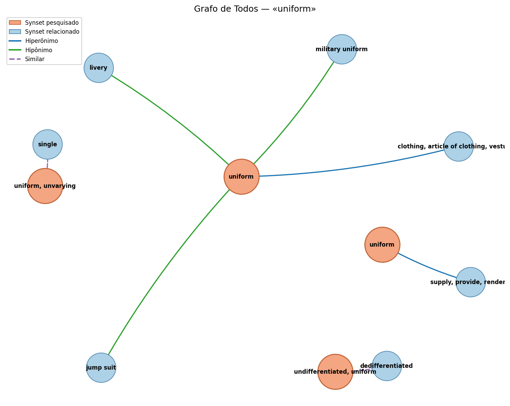

# WordNet — «uniform»  (POS: Todas, idioma: English)
_Gerado: 2026-07-13T12:30:00 · alinhamento: ILI via translate()_

## 1. Synsets & Relações (4)

- **[1] oewn-04516887-n**  (POS n, ILI i60712)
    def.: clothing of distinctive design worn by members of a particular group as a means of identification
    lemmas: uniform
    PT: farda, fardamento, uniforme
    ⬆ hiperónimos: oewn-03055525-n
    ⬇ hipónimos: oewn-03610717-n, oewn-03684500-n, oewn-03769503-n
    derivationally_related_form: uniform

- **[2] oewn-02336782-v**  (POS v, ILI i33388)
    def.: provide with uniforms
    ex.: The guards were uniformed
    lemmas: uniform
    ⬆ hiperónimos: oewn-02332196-v
    derivationally_related_form: uniform

- **[3] oewn-01973553-a**  (POS a, ILI i10771)
    def.: always the same; showing a single form or character in all occurrences
    ex.: a street of uniform tall white buildings
    lemmas: uniform, unvarying
    PT: invariável, uniforme
    antonym: multiform
    derivationally_related_form: uniformity, uniformity
    similar_to: single

- **[4] oewn-00748118-a**  (POS a, ILI i4126)
    def.: not differentiated
    lemmas: undifferentiated, uniform
    antonym: differentiated
    derivationally_related_form: uniformize, uniformity, uniformity
    similar_to: dedifferentiated

## 2. Similaridade (pares; IC carregado)
> lch (Leacock-Chodorow) omitido no relatório em massa por custo (recalcula a profundidade da taxonomia); use a aba Similaridade.

| A | B | path | lch | wup | res | jcn | lin | dist | LCS |
|---|---|------|-----|-----|-----|-----|-----|------|-----|
| oewn-04516887-n | oewn-02336782-v | — | — | — | — | — | — | — | — |
| oewn-04516887-n | oewn-01973553-a | — | — | — | — | — | — | — | — |
| oewn-04516887-n | oewn-00748118-a | — | — | — | — | — | — | — | — |
| oewn-02336782-v | oewn-01973553-a | — | — | — | — | — | — | — | — |
| oewn-02336782-v | oewn-00748118-a | — | — | — | — | — | — | — | — |
| oewn-01973553-a | oewn-00748118-a | 0.0000 | — | — | — | — | — | — | — |

## 3. Hierarquia (profundidade 3)

- **oewn-04516887-n** — profundidade min=7, max=8
    raízes: oewn-04516887-n, oewn-04516887-n
    caminho 1: oewn-00001740-n → oewn-00001930-n → oewn-00002684-n → oewn-00003553-n → oewn-00022119-n → oewn-03127399-n → oewn-03055525-n → oewn-04516887-n
    caminho 2: oewn-00001740-n → oewn-00001930-n → oewn-00002684-n → oewn-00003553-n → oewn-00022119-n → oewn-03080712-n → oewn-03098030-n → oewn-03055525-n → oewn-04516887-n
    hipónimos (fecho): oewn-03610717-n, oewn-03684500-n, oewn-03769503-n, oewn-02814854-n, oewn-03243962-n, oewn-03329873-n, oewn-03407103-n, oewn-03620772-n, oewn-03851754-n, oewn-04078505-n, oewn-03241915-n

- **oewn-02336782-v** — profundidade min=6, max=6
    raízes: oewn-02336782-v
    caminho 1: oewn-02372362-v → oewn-00772482-v → oewn-00126072-v → oewn-02225243-v → oewn-02204104-v → oewn-02332196-v → oewn-02336782-v

- **oewn-01973553-a** — profundidade min=0, max=0
    raízes: oewn-01973553-a

- **oewn-00748118-a** — profundidade min=0, max=0
    raízes: oewn-00748118-a

## 4. Visualização (grafo)
Tipo: Todos · vizinhos/relação: 4 · 11 nós, 7 arestas.

**Arestas:**
- uniform —[Hiperônimo]→ clothing, article of clothing, vesture…
- uniform —[Hipônimo]→ jump suit
- uniform —[Hipônimo]→ livery
- uniform —[Hipônimo]→ military uniform
- uniform —[Hiperônimo]→ supply, provide, render…
- uniform, unvarying —[Similar]→ single
- undifferentiated, uniform —[Similar]→ dedifferentiated
